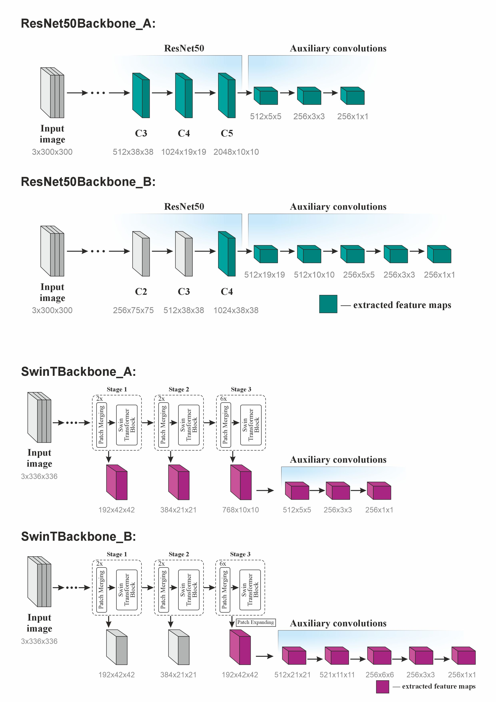

# Swin Transformer

This project is an implementation of the paper **"Swin Transformer: Hierarchical Vision Transformer using Shifted Windows"**. The Swin Transformer serves as a general-purpose backbone for computer vision tasks, effectively addressing the challenges of adapting Transformer models from language to vision.

*(All experiments were done on the Higher School of Economics HPC cluster ['cHARISMa'](https://hpc.hse.ru/hardware/hpc-cluster/) — big thanks to the team!)*

### Model Architecture:


---
### Classification:
The Swin Transformer model (SwinT variant) was pretrained on the ImageNet-1k dataset for the classification task. Training logs and detailed experiment results can be found in *experiments/experiment_1*. The achieved accuracy closely matches the results reported in the [original paper](https://arxiv.org/abs/2103.14030):

| model               | accuracy@1 | accuracy@5|
|---------------------|------------|-----------|
| SwinT  (~28M params)|   0.8060   |  0.9510   |

---

### Detection:
For the detection task, conducted on the Microsoft COCO dataset, an SSD framework was implemented. Several Swin-based backbones were designed alongside reference ResNet-based backbones. The SSD detector was evaluated with different backbones and neck variants—two well-known and one newly proposed. The architectures of the proposed backbone networks are illustrated below:

<p align="left">  </p>

The key detection results are summarized in the table below. The metric reported is the *COCO mean Average Precision (COCO_mAP)*, calculated over IoU thresholds ranging from 0.5 to 0.95 with 11 evaluation points:

| necks▶<br>backbones▼  | no neck  |     FPN      |    PAN   |   DenseFPN   |
|-----------------------|----------|--------------|----------|--------------|
| ResNet50Backbone_A    | 0.228332 |    --        |   --     |     --       |
| ResNet50Backbone_B    | 0.247096 | 0.250236     | 0.252202 | **0.253052** |
| SwinTBackbone_A       | 0.164175 |     --       |    --    |     --       |
| SwinTBackbone_B       | 0.258104 | **0.259176** | 0.258641 |   0.256729   |

Noteworthy: training with Swin backbones is ~1h faster (~6.5 hours versus ~7.5 hours) 
---

### Diffusion generation:
-- in progress 

---

### Repo structure:

 ```
📦swin_transformer
 ┣ 📂configs                          # training configurations
 ┃ ┣ 📜SwinT_clf_300e_default.yaml
 ┃ ┣ 📜detection_ssd_SwinT.yaml
 ┃ ┣ 📜detection_ssd_resnet50.yaml
 ┃ ┗ 📜diffusion_unet_SwinT.yaml
 ┃ 
 ┣ 📂detection
 ┃ ┣ 📜backbones.py
 ┃ ┣ 📜data.py
 ┃ ┣ 📜necks.py
 ┃ ┣ 📜ssd.py
 ┃ ┣ 📜test.py                        # source for full validation pipeline
 ┃ ┣ ⚙️test_detection.sbatch          # slurm script -> test.py (no DDP)
 ┃ ┣ ⚙️train_det_ddp.sbatch           # slurm script -> training.py (DDP)
 ┃ ┣ 📜training.py                    # source for training
 ┃ ┗ 📜utils.py
 ┃
 ┣ 📂diffusion
 ┃ ┣ 📜data.py
 ┃ ┣ 📜diffusion_model.py
 ┃ ┣ 📜schedulers.py
 ┃ ┣ ⚙️train_diff_ddp.sbatch          # slurm script -> training.py (DDP)
 ┃ ┗ 📜training.py                    # source for training
 ┃ 
 ┣ 📂experiments
 ┃ ┣ 📂experiment_0                   # trial run
 ┃ ┣ 📂experiment_1                   # ImageNet classification -> SwinT
 ┃ ┃
 ┃ ┣ 📂experiment_2                   # SSD detection -> ResNet (B)
 ┃ ┣ 📂experiment_3                   # SSD detection -> ResNet (B) + FPN
 ┃ ┣ 📂experiment_4                   # SSD detection -> ResNet (B) + PAN
 ┃ ┣ 📂experiment_5                   # SSD detection -> ResNet (B) + DenseFPN
 ┃ ┣ 📂experiment_6                   # SSD detection -> SwinT (A) (short scheduling)
 ┃ ┣ 📂experiment_7                   # SSD detection -> SwinT (B) (short scheduling)
 ┃ ┣ 📂experiment_8                   # SSD detection -> SwinT (B)
 ┃ ┣ 📂experiment_9                   # SSD detection -> SwinT (B) + FPN  
 ┃ ┣ 📂experiment_10                  # SSD detection -> SwinT (B) + PAN
 ┃ ┣ 📂experiment_11                  # SSD detection -> SwinT (B) + DenseFPN
 ┃ ┃
 ┃ ┣ 📂experiment_12                  # diffusion -> SwinUNet (CIFAR-10)
 ┃ ┣ 📂experiment_13                  # diffusion -> SwinUNet (CIFAR-10)
 ┃ ┗ 📂experiment_14                  # diffusion -> SwinUNet (MNIST) 
 ┃
 ┣ 📂notebooks                        # some old colab drafts 
 ┃ ┣ 📜ImageNet_classification.ipynb
 ┃ ┗ 📜playground.ipynb
 ┃
 ┣ 📂saved_weights
 ┃ ┣ 📦SwinT_statedict.pth            # stored locally 
 ┃ ┗ 📦resnet50_statedict.pth         # stored locally
 ┃
 ┣ 📜data.py
 ┣ 📜model.py                         # Swin Transformer implementation
 ┣ ⚙️train_clf_ddp.sbatch.            # slurm script -> training.py (DDP)
 ┣ ⚙️train_clf_default.sbatch
 ┣ 📜train_clf_imagenet.py
 ┗ 📜training.py                      # source for classification training
 ```

### References & Useful sources:

* [Original Swin paper](https://arxiv.org/abs/2103.14030)
* [Official Swin implementation by Microsoft](https://github.com/microsoft/Swin-Transformer)
* [Original SSD paper](https://arxiv.org/abs/1512.02325)
* [Very good SSD tutorial](https://github.com/sgrvinod/a-PyTorch-Tutorial-to-Object-Detection/tree/master)